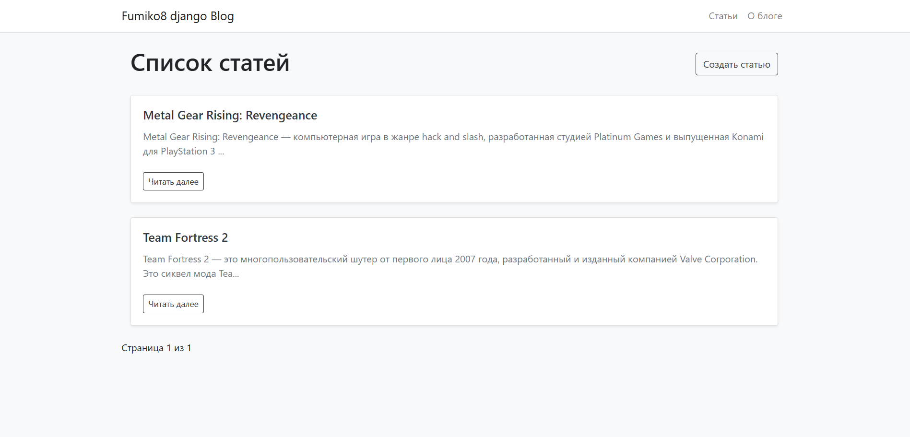
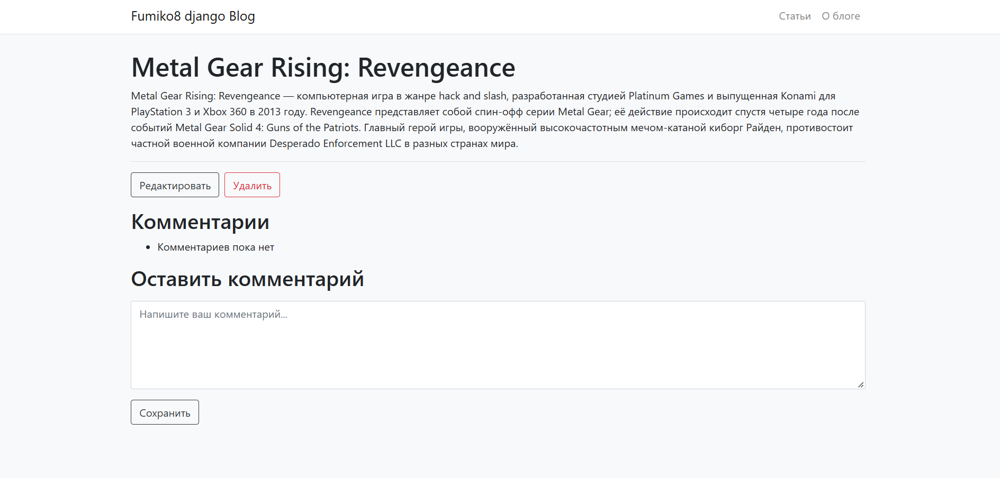
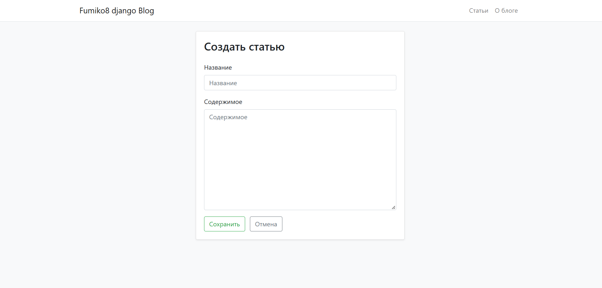
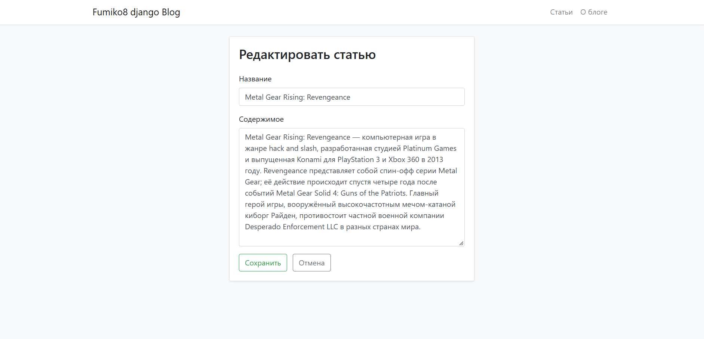

# Django Blog

Блог на Django. Реализован полный CRUD для статей,
комментарии, пагинация, флеш-сообщения, валидация форм и оформление на Bootstrap.

## Стек

- Python 3
- Django
- SQLite
- Bootstrap 4
- factory_boy (для тестовых данных)

## Возможности

- Список статей с пагинацией (по 15 на страницу)
- Просмотр статьи и добавление комментариев
- Создание, редактирование и удаление статей
- Флеш-сообщения после успешных действий
- Админка с поиском, фильтрами по дате и списком полей
- Тесты на `TestCase` + фабрики `ArticleFactory`

## Скриншоты

### Список статей


### Страница статьи с комментариями


### Форма создания статьи


### Форма редактирования статьи



## Запуск

```bash
python -m venv .venv
source .venv/bin/activate       # Windows: .venv\Scripts\activate
python manage.py migrate
python manage.py runserver
